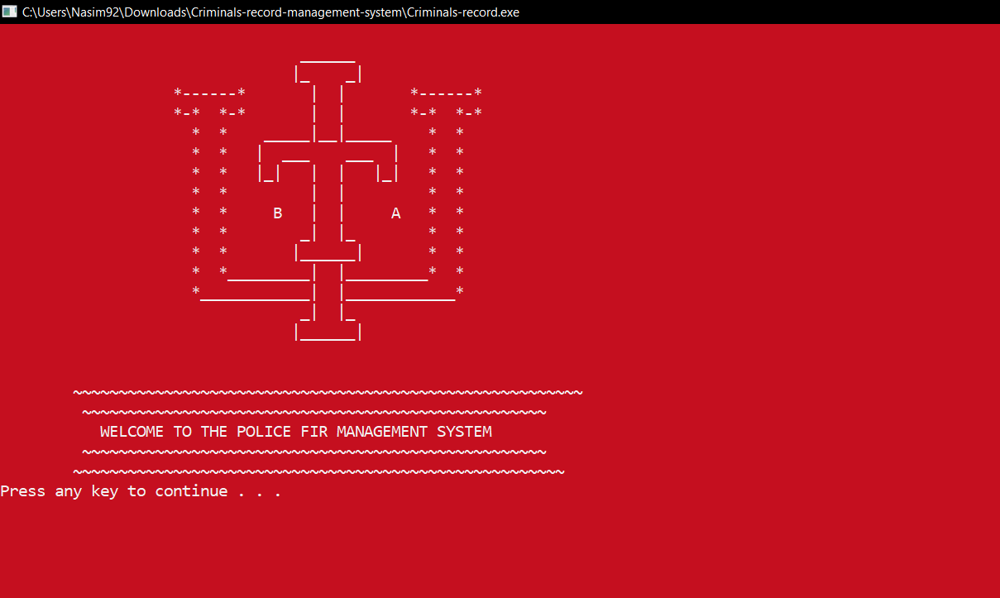
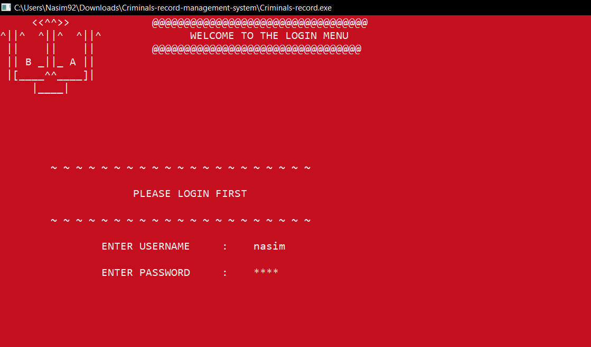
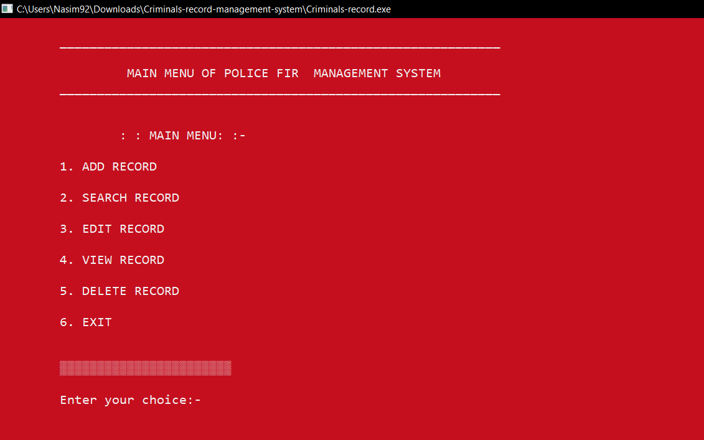

## CPP-Project
This project is based on Police Fir Management System.This is little project .This project includes all the basic functionalities .
Such as add ,delete,modify,search ,view functions and there is also contains file functionalities The whole project is done by only c++.
## Here, I am trying to do this project using Class and Objects of C++.
##### This project had been done for the requirements of C++ courses.

###### For log in 
The UserName is nasim.
password is 1234

##### Here is the live video link of this project
https://www.youtube.com/watch?v=2SyPPocTjLQ

#### Some Samples of this project is given below :

